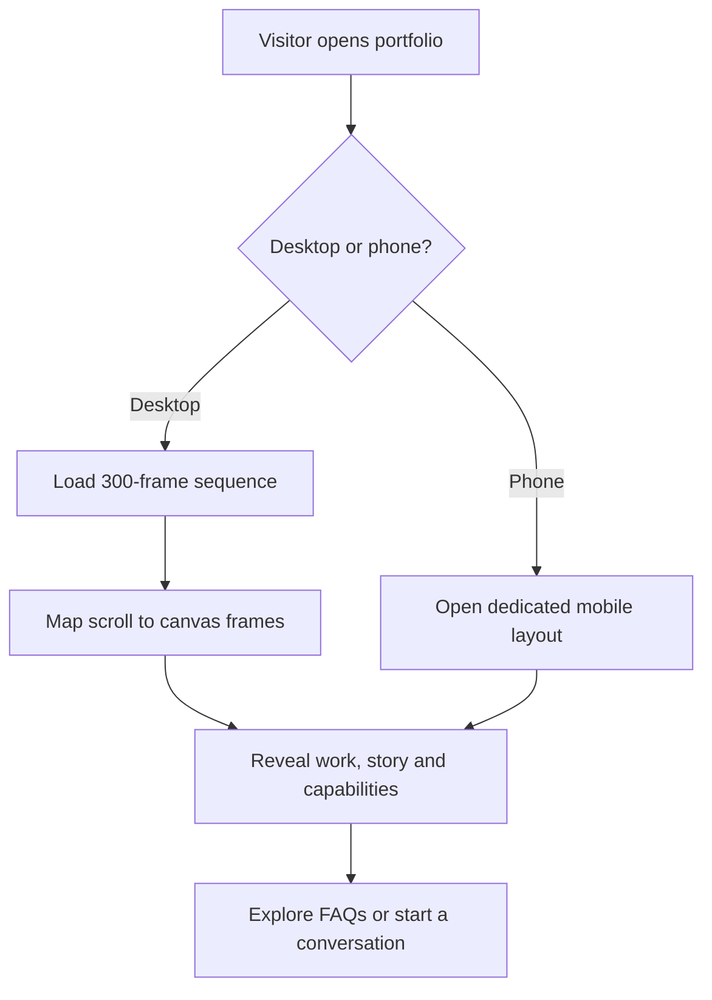

<div align="center">

# UTTAM TORRY

### Software Developer Portfolio

**Careful engineering · Thoughtful products · Meaningful experiences**

A cinematic web portfolio that brings together software development, product thinking, visual storytelling and a growing body of real project work.

[](https://sarva-uttam.github.io/Portfolio.ut/)
[](https://www.linkedin.com/in/uttam-torry-490702361/)

**Graduate Software Developer · Mauritius · Open to relocation and international opportunities**

</div>

---

## The idea behind the portfolio

Most portfolios behave like digital résumés: a heading, a skills list and a grid of project cards. I wanted this one to feel more deliberate.

This website was designed as a guided journey. On desktop, scrolling moves the visitor through a 300-frame cinematic sequence while the content assembles around the central portrait. Each stage introduces a different part of my professional story: who I am, what I have built, how I approach engineering and where I want to grow next.

The visual experience is supported by a practical technical foundation. The website is lightweight, framework-free, accessible and deployed as a static application. A separate mobile experience keeps the content clear and comfortable on smaller devices without trying to compress the desktop composition into an unsuitable layout.

> The goal is simple: let the presentation be memorable while the engineering remains understandable.

## Meet the developer

I am **Uttam Torry**, a graduate software developer with a Bachelor of Software Engineering from the National Research University of Electronic Technology (MIET).

My work sits at the intersection of:

- responsive front-end development;
- JavaScript and TypeScript engineering;
- product and interface design;
- backend and database thinking;
- testing and technical documentation;
- requirements analysis and system architecture.

I am at the beginning of my professional engineering career, and I value honest presentation over exaggerated claims. This portfolio focuses on tangible work, thoughtful decisions and the ability to turn an idea into a structured digital product.

Previous experience in hospitality, tutoring and delivery has also strengthened the way I communicate, adapt and take responsibility in demanding environments. I speak **English, French, Hindi and Russian**, and I am open to graduate or junior opportunities in Mauritius and internationally.

## Selected projects

<table>
<tr>
<td width="50%" valign="top">

### 01 — ISeeCode

**Visual code interpreter**

A browser-based educational system designed to make program execution easier to understand. It breaks code down step by step and presents variable changes, control flow, intermediate results and errors as a visual learning sequence.

**Focus:** interpreters, execution tracing, developer education and multi-language analysis.

**Languages:** C++, Python, JavaScript and C#.

</td>
<td width="50%" valign="top">

### 02 — Enveloped

**Digital invitation platform**

A full-stack product for creating personalised digital invitations shaped around the occasion, visual direction and budget. The project explores the complete customer journey—from creation and ownership to sharing, guest responses and event management.

**Focus:** product design, authentication, privacy, payments and responsive experiences.

</td>
</tr>
<tr>
<td width="50%" valign="top">

### 03 — Zordi Budget Tracker

**Civic technology platform**

An evidence-led public accountability system for following government commitments from announcement to delivery. It separates claims, sources, evidence, financial information and editorial assessment so that progress can be reviewed transparently.

**Focus:** Next.js, TypeScript, PostgreSQL, structured evidence and role-based workflows.

</td>
<td width="50%" valign="top">

### 04 — Bwoo & Bloo’s Books

**Creative publishing system**

A structured production system for an educational book series. It brings together editorial planning, recurring character standards, illustration consistency, asset tracking, review gates and repeatable publishing workflows.

**Focus:** content systems, quality control, creative operations and scalable asset production.

</td>
</tr>
</table>

## What makes this website different

### A scroll-controlled cinematic experience

The desktop hero is built from **300 individual image frames**. JavaScript preloads the sequence, maps the visitor’s scroll position to a target frame and renders it on an HTML canvas. Frame movement is smoothed with `requestAnimationFrame`, giving the page the feeling of a controlled animation without embedding a conventional video player.

### Content that assembles around the story

The introduction, projects, biography and capability cards do not simply fade between sections. Their motion is calculated from scroll position. Components enter from different directions, hold in place and leave in reverse order. Because the animation is position-based, scrolling upward reconstructs the experience naturally.

### A locked visual stage

The primary desktop composition uses a fixed **1280 × 720 stage**. The portrait, canvas and interface overlays share the same scale transformation, preserving their alignment across screen sizes and browser zoom levels. This keeps the experience behaving like a responsive digital poster instead of allowing individual elements to drift.

### A purpose-built mobile version

Phones receive a dedicated vertically scrolling experience. It keeps the same professional story and visual identity while replacing the heavy cinematic interaction with a simpler layout better suited to touch input, narrow screens and mobile reading.

Visitors can switch between views, and their preference is remembered in local storage.

### Accessible native interactions

The portfolio uses established browser features wherever they are the strongest choice:

- semantic page structure and navigation;
- visible keyboard focus states;
- native `<dialog>` for the contact chooser;
- native `<details>` and `<summary>` for FAQ accordions;
- keyboard-operable navigation and controls;
- reduced-motion consideration;
- descriptive labels and appropriate ARIA states.

## How I executed the website

The work began with the experience architecture: dividing the professional story into four stages and deciding how each stage should appear during the scroll sequence.

I then built the static page structure in semantic HTML and created the complete visual system in CSS, including the dark editorial palette, green accents, typography, responsive navigation, project panels and HUD-inspired details.

For the cinematic layer, I prepared the image sequence, implemented progressive frame preloading and connected scroll progress to canvas rendering. Each overlay animation was defined as a pure function of the current frame range, which keeps the sequence reversible and avoids inconsistent animation states.

The desktop composition was locked to a single scalable stage. The mobile page was then developed as a separate experience, while shared navigation, footer and interaction logic were kept reusable across the portfolio, mobile page and FAQ.

Finally, I configured an automated GitHub Pages workflow so every accepted update to `master` can be packaged and deployed consistently.

## Experience flow



## Technical architecture

The portfolio is intentionally built without a frontend framework or server-side application. This keeps the deployment surface small and makes the interaction logic visible in the source.

| Layer | Responsibility |
|---|---|
| HTML | Semantic content, navigation, project information, dialogs and FAQ structure |
| CSS | Visual system, fixed-stage composition, responsive layouts and interaction states |
| JavaScript | Preloading, canvas rendering, scroll mapping, animation, routing and UI behaviour |
| Canvas | High-performance display of the cinematic frame sequence |
| Browser APIs | Intersection observation, local preferences and native interactive components |
| GitHub Actions | Repeatable static-site packaging and deployment |
| GitHub Pages | Public hosting of the production portfolio |

## Interaction timeline

| Frame range | Portfolio stage | Purpose |
|---|---|---|
| 1–34 | Introduction | Establishes professional positioning, availability and contact routes |
| 58–150 | Selected work | Presents the four projects and the thinking behind them |
| 140–236 | About | Shares education, values, experience and spoken languages |
| 228–300 | Capabilities | Brings the technical capability cards into an animated orbit |
| After frame 300 | Contact | Releases the pinned scene and transitions into the final invitation to connect |

The frame ranges intentionally overlap. These transition windows allow one stage to leave as the next begins, creating continuity rather than abrupt section changes.

## Engineering decisions

### Why a static architecture?

The portfolio does not need accounts, stored user data or server-generated pages. A static architecture provides:

- fast and predictable delivery;
- a reduced security surface;
- straightforward version control;
- simple recovery and deployment;
- no runtime server or database dependency;
- direct ownership of the interaction code.

### Why canvas for the hero?

Displaying hundreds of full-screen frame elements would create unnecessary layout and memory pressure. A single canvas provides one controlled rendering surface while the preloader manages the available images behind it.

### Why separate desktop and mobile layouts?

The desktop experience depends on a wide cinematic composition. Reflowing that scene into a narrow viewport would weaken both readability and visual balance. The dedicated mobile page respects the device instead of forcing the same interaction everywhere.

### Why position-based animation?

Time-based animations can become disconnected from the user’s scroll direction. Deriving every transition from the current scroll position makes the result deterministic, reversible and easier to tune.

## Repository map

```text
Portfolio.ut/
├── index.html
│   └── Desktop cinematic experience and primary content
├── m.html
│   └── Dedicated mobile portfolio experience
├── faq.html
│   └── Accessible frequently asked questions
├── styles.css
│   └── Design system, layouts, animation states and responsive rules
├── script.js
│   └── Frame engine, scroll logic, navigation and shared interactions
├── assets/
│   └── Cinematic frame sequence and website resources
└── .github/workflows/
    └── Automated GitHub Pages deployment
```

## Performance approach

The site keeps its runtime focused on the work required for the experience:

- frames are preloaded before the main sequence begins;
- one canvas is reused throughout the cinematic section;
- rendering is coordinated through the browser animation cycle;
- interaction states are derived rather than accumulated;
- shared JavaScript safely supports pages without the hero canvas;
- the mobile version avoids loading the complete desktop interaction;
- no application server is required.

## Deployment workflow

The production site is deployed through GitHub Pages.

A push to the `master` branch starts the deployment workflow, checks out the repository, configures Pages, uploads the static site and publishes the new version. The deployment process is stored with the project, making releases repeatable and visible through the repository’s Actions history.

<div align="center">

## Explore the work

The best way to understand the project is to experience it as it was designed.

[](https://sarva-uttam.github.io/Portfolio.ut/)
[](https://www.linkedin.com/in/uttam-torry-490702361/)

---

Built with care by **Uttam Torry**  
**Evidence-led · Tested · Documented**

</div>
